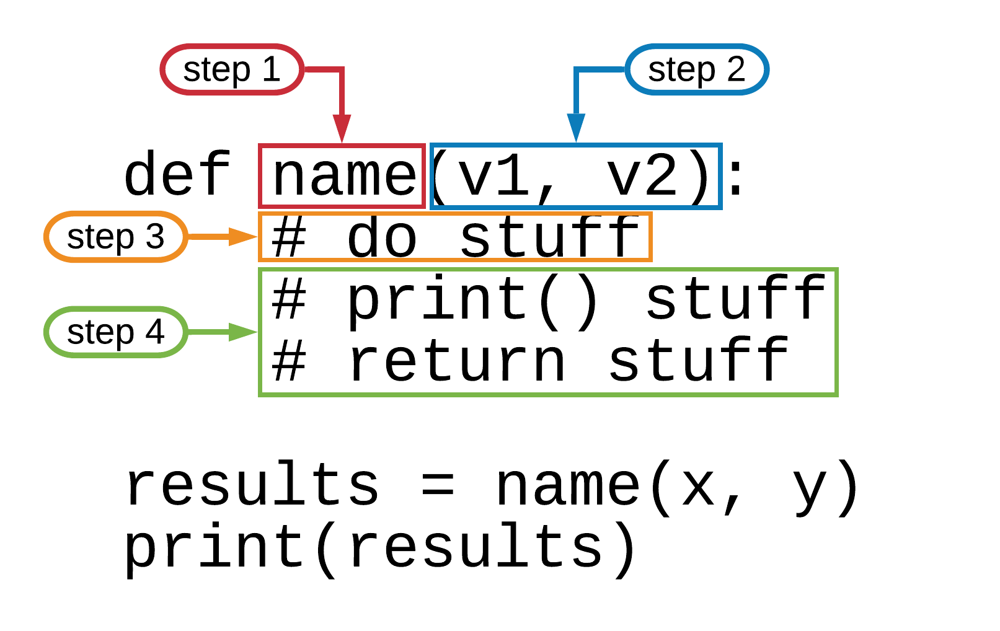

# Python Functions Worksheet

This worksheet is designed to help you think through the steps and manage the information needed to create a function. You should only need this until you are comfortable with creating them, and then not much after that.  The guidance in this worksheet is not meant to represent every possible use of the function call, but to showcase a minimal pattern that offers a clean data flow and strong protection against odd execution. This pattern is also highly extendable without having to clean up too much along the way. 

Your first task with learning functions is to get used to the syntax, and then your understanding of the use cases, scope, problem boundaries, etc. will grow.

## Function syntax diagram

This worksheet will not go into a lot of the details about the syntax, but here is a diagram of a function with labels corresponding to the steps in this worksheet.



## Step 1:  What is the problem?

In this step, you need to identify what the task is that you need to write a function for. At the beginning, you'll be writing functions to solve problems from the textbook or during class. Their scope will be given to you as part of the problem text.

This step will help you determine what the name of the function should be and start thinking about what it should be doing.

* Briefly describe what the function should do.  Try getting it into one sentences or just a few short ones. Keep it high level.
* Can you summarize that into a really short action phrase?
	* First, pick a verb.  Use something like create, calculate, transform, prepare, etc.  Think resume action verbs here.
	* Second, determine the object. This is the thing being changed or produced.  Like, "clean sentences" or "format file names".
* Now put them together, and separate the spaces by `_`.  So "clean sentences" would become `clean_sentences`.

Alternatively, the problem text might give you a name to use.

Once you have this name, you can start constructing your `def` block.

You should begin with this code, replacing `name` with the name that you chose:

``` python
def name():
	# ensure this is tabbed over
```

This code is not complete at this point and will generate errors if you try to run it as it stands.

# Step 2: What are your inputs?

This is a step that you may not be able to fully understand before attempting the code. However, it's worth sitting down to think about the issue first.  Your answer may change as you begin to solve the problem, but you likely can come up with a pretty close guess at this point.  You may also be working with a problem that tells you exactly what should be your inputs.

Inputs into functions are technically optional, and there are some occasions where not using them is desired. This is where we will start.  The inputs you select will be the ones that the function just needs to access to make decisions, but will not actively be changing. Other inputs are values that the function may want to alter or change. 

* Do you need to use any values from the larger program (the code that will be calling this function)? yes/no
* Do you need to transform any inputs or values from the large program? yes/no

Rough decision tree:

* Yes to either or both of these:
	* You will need to add parameter inputs for this function.
	* Are you wanting to add a function into an existing program you are currently working on?
		* Yes: Go through your program and try to identify which of the existing variables you will want the function to have access to.
		* No: Go through the problem you are working on and make a list of any variables or inputs it mentions, and flag any that will be coming in from the broader program into the function. This may be subtle, remember you can always revisit this section as needed.
* No to both of these questions: 
	* Take a look again and be very sure that you are correct. You can always go back and add them in if that's the case.
	* You can go ahead and skip to the next section. No input needed.

Once you have the variables or inputs identified, you need to select which order to put them into the parameter clause and what their names should be. This worksheet is also choosing to ignore keyword arguments, *args, and **kwargs.

Order: doesn't entirely matter, but this is the order that the function will need to be called with.  So if there is some type of reasonable order, this is the time to think about it.

Name:  For each of the variables that you identified, you must be able to answer the following questions:
	
* What is the variable name for where this value exists in the main program? 
* What is the data type?
* Briefly, what will it contain (semantic answer, not data type)?
* What should the parameter variable name be within your function? This should be different from the broader code calling your function. Not technically an error, but it can lead to confusion if your function parameters share variable names with the main program.

Again, these things might change as you progress, but you should have a good sense for most of this.

Once you have these answered, you are ready to expand your code.

```python
def name(variable1, variable2):
	print(variable1, variable2)
```

Essentially, you will be adding your list of variable names into the `()` in the `def` line. So `name()` should become `name(v1, v2)` for example, if my two parameter variable names are `v1` and `v2`. You should ensure that your parameter variables are clearly named so you understand what they will receive once the function is called. 

The print statement within the function body (which is the code tabbed under the `def` block, is there just to make the function syntax valid and allow us to see the values coming in and out of the function.

We can see the function in action by adding a bit more code:

```python
def name(variable1, variable2):
	print(variable1, variable2)
	
name("first string", "second string")
``` 
You should do your best to replace the two strings I've provided into examples of the inputs your function should take.  However, this example is just fine to check that all the input/output mechanisms are working.  You should see the following in your output:

```text
first string second string
```
Remember, our purpose with this step was just to get the inputs functional.

# Step 3:  Craft your function body

This is the step that is really up to you, and were you populate the logic and activities within the function.  Let's say that the function we had needed to title case and concatenate our strings together, but we would only get a single string. So this input: "hello there human" would become "HelloThereHuman".  

```python
def title_concat_phrase(original_phrase):
    titlephrase = original_phrase.title()
    words = titlephrase.split()
    rejoined = "".join(words)
```

If it makes sense for your program, retain any print() statements you'd like within your `#do stuff` phase.  This phase should process any inputs and prepare a single result.

# Step 4: What do you want out of this function?

While not required, you should consider it a default requirement that you return a value from your function.

* Do you just want to "see" the values from your function?  As in, do you not need to use those values later in the program?
	* No, I will not need to use the values later in my program or save them after the function executes.
		* Just use `print()` in your function to see the value.
	* Yes, I will need to use the values later.
		* You will need to use `return` (remember this is a keyword and not a function) to pass the value back to the main program.
	* I don't need either.
		* Fine, you don't have to use either. 

Example with a return statement:

```python
def title_concat_phrase(original_phrase):
    titlephrase = original_phrase.title()
    words = titlephrase.split()
    rejoined = "".join(words)
    return rejoined
    
result = title_concat_phrase("we are a snake family")
print(result)
```
Your result will be:

```text
WeAreASnakeFamily
```